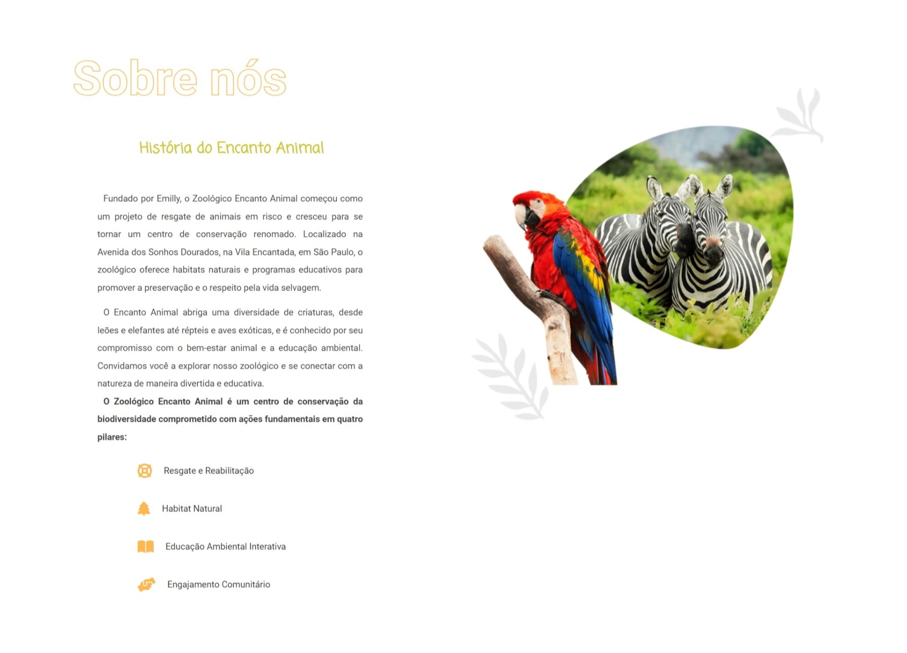
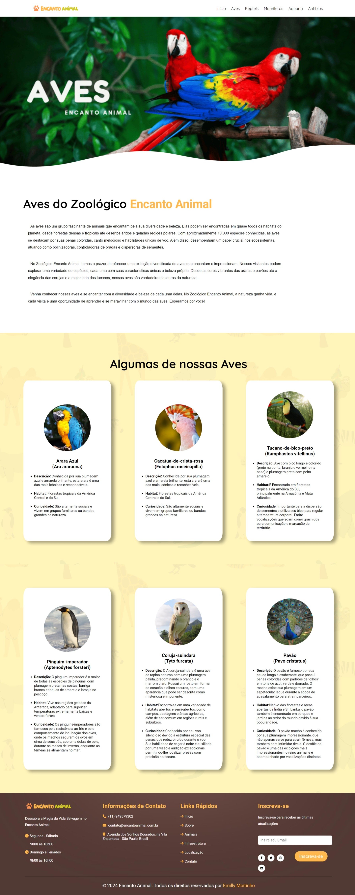
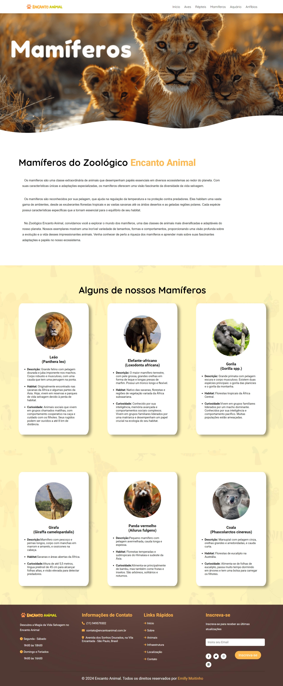
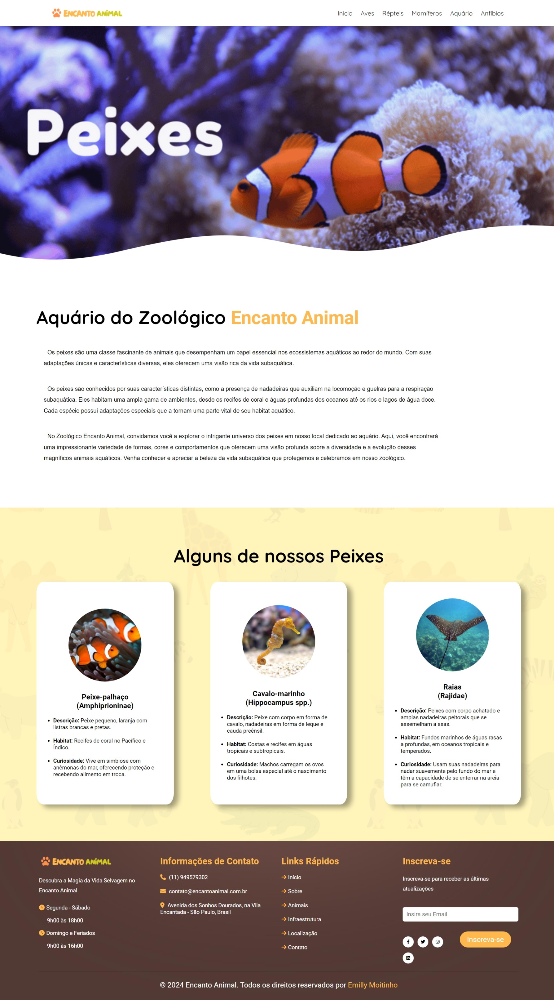
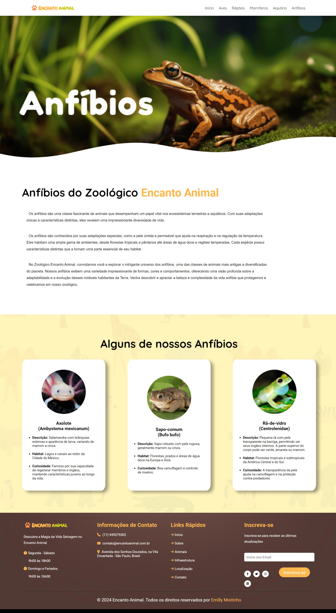
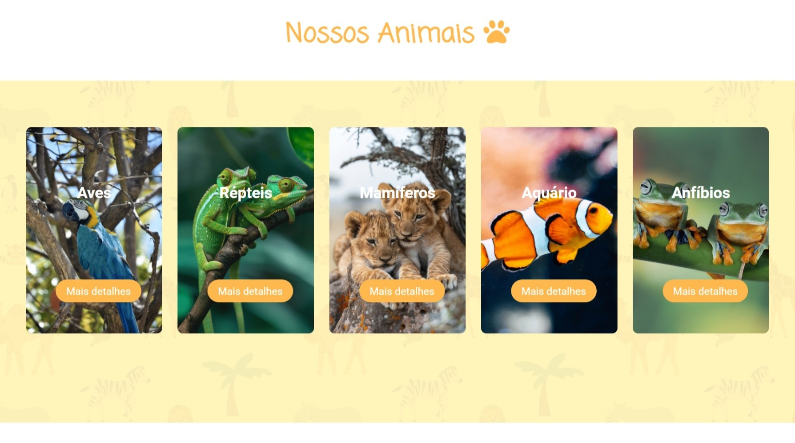
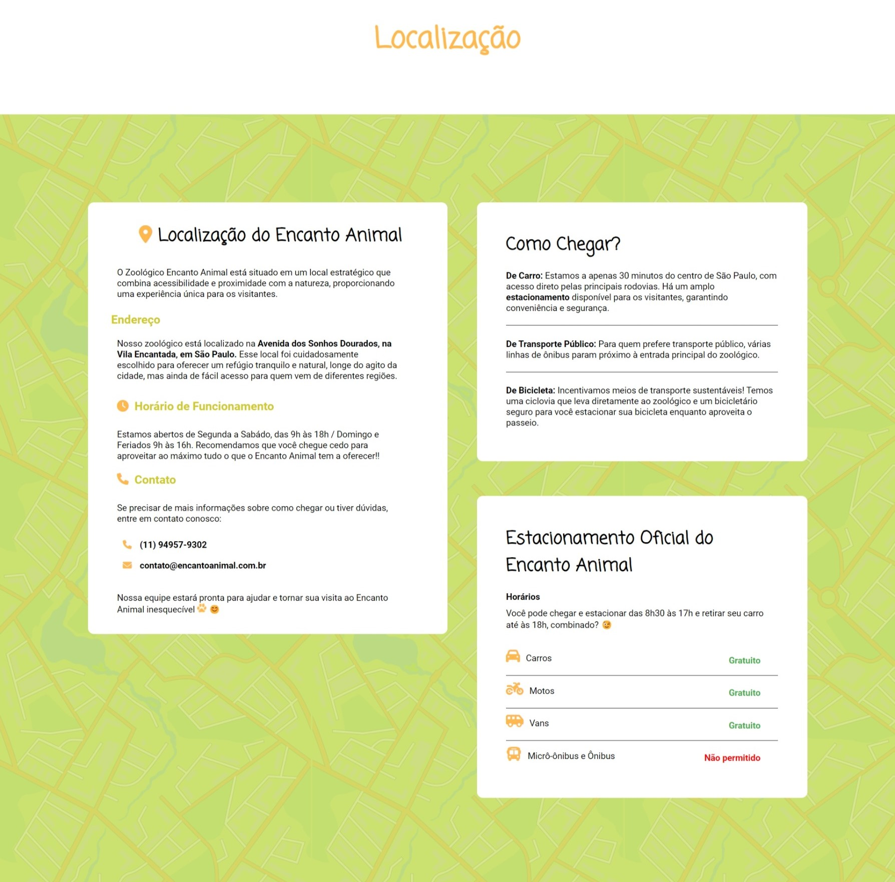
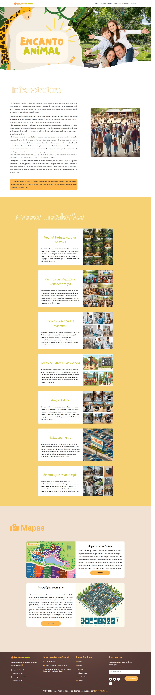

# Encanto Animal 

O Zoológico Encanto Animal foi um site desenvolvido para a disciplina de Tecnologia Web do curso de Análise e Desenvolvimento de Sistemas do ENIAC. Este projeto apresenta um **ZOOLÓGICO FICTÍCIO**, oferecendo informações sobre as diversas categorias de animais, a infraestrutura do zoológico e os programas educativos que promovem a conservação e o respeito pela vida selvagem.

Link: https://emillymoitinho.github.io/encanto_animal/

## Sobre o Encanto Animal
Fundado por Emilly, o Zoológico Encanto Animal começou como um projeto de resgate de animais em risco e cresceu para se tornar um centro de conservação renomado. Localizado na Avenida dos Sonhos Dourados, na Vila Encantada, em São Paulo, o zoológico oferece habitats naturais e programas educativos para promover a preservação e o respeito pela vida selvagem.

**O zoológico é conhecido por seu compromisso com o bem-estar animal e a educação ambiental, convidando todos a explorar e se conectar com a natureza de maneira divertida e educativa.**

## Nossos Animais 🐾
O Encanto Animal abriga uma diversidade de criaturas, incluindo:

- Aves
  
- Répteis
  
- Mamíferos
  
- Peixes
  
- Anfíbios
  

## Localização

O Zoológico Encanto Animal está situado em um local estratégico que combina acessibilidade e proximidade com a natureza, proporcionando uma experiência única para os visitantes.

Endereço: Avenida dos Sonhos Dourados, Vila Encantada, São Paulo.

Horário de Funcionamento:

- Segunda a Sábado: 9h às 18h
- Domingo e Feriados: 9h às 16h

## Infraestrutura
O zoológico possui uma infraestrutura cuidadosamente planejada, que inclui:

- **Habitats Naturais:** Projetados para replicar os ambientes naturais das espécies.
- **Centros de Educação e Conscientização:** Para palestras e atividades interativas.
- **Clínicas Veterinárias Modernas:** Para garantir a saúde e o bem-estar dos animais.
- **Áreas de Lazer e Convivência:** Incluindo playgrounds e espaços para piqueniques.
 - **Estacionamento:** Amplo e seguro, com capacidade para até 500 veículos.

